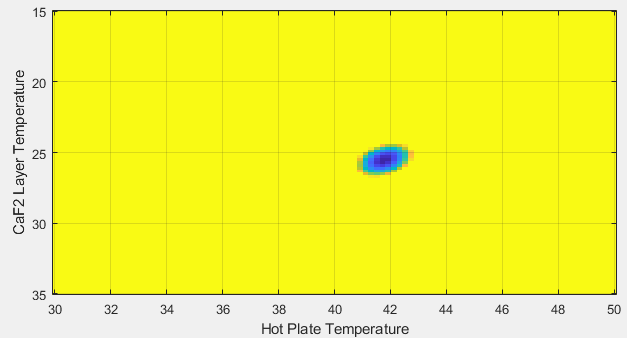

# infrared-sounding
Error-correcting remote sensing code for uncalibrated radiometric measurements of a material's temperature
This isn't my most intuitive project, so you may not find it interesting unless you are a physicist.

Regardless, its basically using some information about the varying transmisison spectra of 3 infrared filters to effectively solve a 5-variable linear algebra problem (arising from Cramer's Rule) despite only having 3 equations using some computer wizardy. This works because the 3 filters overlap slightly, and by analysing the data's response in each critical area we can extrapolate certain amounts of infromation. It's not perfect, of course, but some surprisingly good data can be found.

